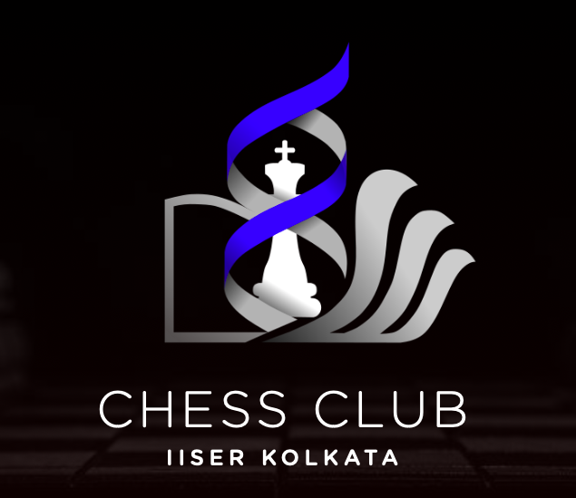

# Welcome to the Chess Club of IISER Kolkata!
We heartily welcome you to our chess club as we practice and hone our skills in the game. The primary vision of the club is to act as a platform for players to sharpen their skills in the game, increase their critical thinking and to promote chess in the institute and beyond.

To know more about our club, check out our website: https://www.iiserkol.ac.in/~chess.activity/

## Registration
You will we provided with your id's (for instance: 18MS112) and mailing addresses (for instance: dk18ms112@iiserkol.ac.in) once you join the institute. First create an account on [Lichess](https://lichess.org/) if you don't have one, and send a request to join our team [IISER-K Chess Club](https://lichess.org/team/iiserk-chess-club). 

Next, to verify your details fill this [form](https://docs.google.com/forms/d/e/1FAIpQLSduDBkqS9zV-vw1UqOaYuuKHgnhztQ1etTXO9fZgVRo6hayYg/viewform?usp=sf_link). Once you do so, you will be added to our chess team on Lichess (provided the details are legit) and you will be able to participate in the online tournaments we conduct.

If you're still not added within a few hours or if you face any trouble, shoot us an email at chess.activity@iiserkol.ac.in with the details of your
- Name
- Institute ID
- Lichess Username

or reach out to any of the office bearers.

## Resources and Tips
Below are a list of resources for chess enthusiasts of all skill levels to improve their game-
### Noobs (<800)
- **General Play**
  - Think "checks, captures, threats" every move
  - You're mostly not able to hold your pieces, and you're losing them either because the opponent attacked them, and you didnt see, or the opponent forked 2 pieces who both were undefended. So whenever developing pieces, ensure that they are defended.
  - [Strategic Ideas in the Opening Seirawan vs. Miles - GM Yasser Seirawan](https://www.youtube.com/watch?v=Ohf79-nlekc&list=PLVWaFpMwtaGiVZ77NhhvGGGzvF7oFSWcA&index=13)
  - Never resign! (against players at your level and within reason). People blunder a lot, be ready to take advantage!
  - Play as many online games as you can, your best way to increase your level is to keep playing, gaining experience, and analysing your games after the match, and try not to repeat those mistakes again.
  - [Play winning chess by Yasser Seirawan](https://drive.google.com/file/d/12yNlUmwQMKKjpe9Pmvbeux-i6i_MpXbB/view?usp=drivesdk)
  - [Saint Louis Chess Club Videos](https://www.youtube.com/playlist?list=PLVWaFpMwtaGj-HHi0t8bHxFzNtDwLoWon)

- **Opening**
  - Stick to principles! Develop all your pieces, control the centre, avoid moving the same piece twice, castle quickly, do not move too many pawns on the side you've castled.
  - Development: Two ways to develop by pushing the pawns ahead to gain more area of the board by placing pieces on active squares from their initial position.
  - To control the center, try not exchanging your center pawns with side pawns (also called flank pawns).
  - Make sure to castle your king. If your opponent hasnt castled, and you have, then try to open up the center so that the enemy king is exposed.
  - DO NOT study predefined openings, only play with your logic and opening principles.
  - [Top 10 opening principles](http://www.chessfornovices.com/chessopeningstrategy-top10principles.html)
  - [What Do I Move in the Opening? - Yasser Seirawan](https://www.youtube.com/watch?v=2WxcHxN9nQs&list=PLVWaFpMwtaGiVZ77NhhvGGGzvF7oFSWcA&index=77)
  
- **Middle Game**
  - Keep looking for undefended pieces of the opponent, try to fork (attack simultaneously) two or more pieces so that you can take one of them

- **End Game**
  - Study the Two queens/rooks vs lone king endgame
  - In the end game, if there are pawns on both sides, then bishops are better than knights, but if they're one side, knights are better, that's because your bishops can keep an eye on both sides.

### Beginners (800-1300)
- **General Play and Openings**
  - Do not hang pieces!
  - Never play f6
  - Try to take chances in your casual games,eg. try to play gambits or openings that are conjugate to your preferred style of play, you'll learn many different styles of play that way. Or for eg. try to sometimes exchange queen for a rook and bishop.	
  - [Instead of particular openings, you can read about different opening systems: Ten-system-openings](https://www.chess.com/forum/view/for-beginners/ten-system-openings)
  - [Opening Ideas/Theory - GM Yasser Seirawan](https://www.youtube.com/watch?v=-WEFr1dwqys&list=PLVWaFpMwtaGiVZ77NhhvGGGzvF7oFSWcA&index=6)
  - [Strategic ideas in the opening](https://www.youtube.com/watch?v=Ohf79-nlekc&list=PLVWaFpMwtaGiVZ77NhhvGGGzvF7oFSWcA&index=13)

- **Middle Game**
  - [Improve your tactics](https://www.reddit.com/r/chess/wiki/resources#wiki_tactics)  
  - Ask your pieces if they are happy at their positions, and if not, ask them, where would they be the happiest, and then think about how you can achieve that. Try to keep maximum pieces 'happy' on the board, this will improve your position	
  - Make sure to castle your king. If your opponent hasnt castled, and you have, then try to open up the center so that the enemy king is exposed.

- **End Game**
  - King and pawn endgames. Recognize wins and draws
  - Common piece mates (KQ vs K, KR vs K)
  - In the end game, if there are pawns on both sides, then bishops are better than knights, but if they're one side, knights are better, that's because your bishops can keep an eye on both sides.
  - [Essential Endgames](https://www.youtube.com/watch?v=ZpeRfZlzVVQ&list=PLVWaFpMwtaGj-HHi0t8bHxFzNtDwLoWon&index=4)

### Intermediate (1300-1800)
- **General Play**
  - Do not hang pieces! Look out for forks!
  - The clock is a weapon.

- **Opening**
  - Learn refutations of common gambits.
  - [Winning Chess Openings by Yasser Seirawan](https://drive.google.com/file/d/13EJ8wNr39PUAzIVMB_DmBaJaSm0zON14/view?usp=drivesdk)
  - [Youtube - Hanging Pawns (has a detailed catalogue on most openings and variations)](https://www.youtube.com/channel/UCkJdvwRC-oGPhRHW_XPNokg)

- **Middle Game**
  - [Winning Chess Strategies by Yasser Seirawan](https://drive.google.com/file/d/136mTxiX8WQmX4_uAcahcShJgHW3Udr8n/view?usp=drivesdk)
  - [Karpov and his Ruy Lopez | Mastering the Middlegame - GM Ben Finegold](https://www.youtube.com/watch?v=enR0ntHVjG8)

- **End Game**
  - [King, rook and pawn endgames (Lucena, Philidor, Vancura positions), John Bartholomew's videos on these are excellent](https://www.youtube.com/channel/UC6hOVYvNn79Sl1Fc1vx2mYA)
  - Other piece mates (KBB vs K, KBN vs K although extremely uncommon)
  - Learn how to try and force draws in losing positions (perpetual checks, stalemates, exchange down to insufficient mating material)
  - [Winning Chess Endings by Yasser Seirawan](https://drive.google.com/file/d/131TvzVx4pElvrC7yu7HEJWGxSoe12Pqj/view?usp=drivesdk)
  - [Pandolfinis endgame course](https://drive.google.com/file/d/1I4OmAvcxqKLjFhBNo5wJM3oqW7EqThXR/view?usp=sharing)
  
### Advanced (1800-2200 and above)
> "Always look for a better move" :)

## Contributions
Most of the resources compiled by @sahasatvik and @ParthBibekar. Feel free to contribute to this by submitting a pull request.
